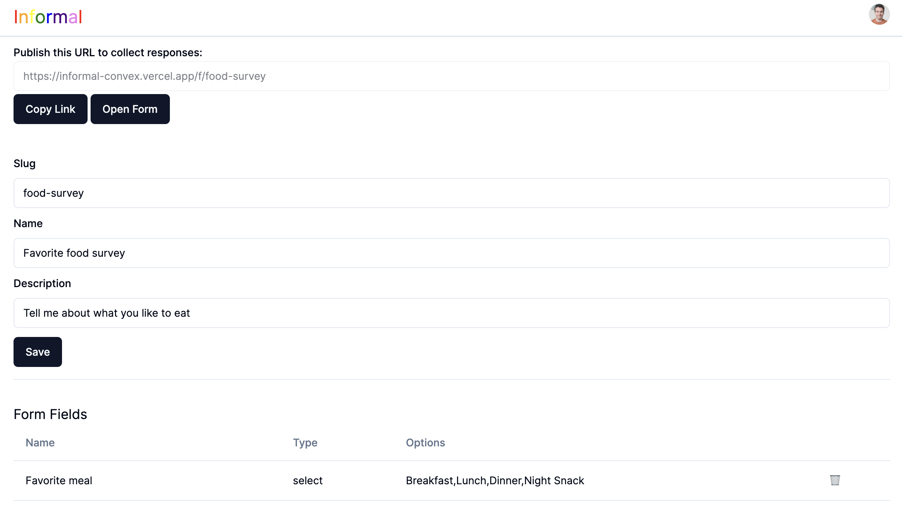

# Informal



A free form builder built with [Next.js](https://nextjs.org/) and [Convex](https://www.convex.dev/).
- Design forms with unlimited fields.
- Collect responses.
- View user submissions in real-time.
- Fully reactive and cloud-based.
- Easily deploy to Vercel, Netflify or similar.

## Running the App

For user authentication, follow the [Clerk setup instructions](https://docs.convex.dev/auth/clerk) to obtain a **publishable key** and then set it up as `NEXT_PUBLIC_CLERK_PUBLISHABLE_KEY` environment variable in `.env.local`.

To run the app:

```
npm install
npm run dev
```

This will configure a Convex project if you don't already have one, open the
Convex dashboard and the web app running on `localhost`.

Open [http://localhost:3000](http://localhost:3000) with your browser to see the result.


# What is Convex?

[Convex](https://convex.dev) is a hosted backend platform with a
built-in database that lets you write your
[database schema](https://docs.convex.dev/database/schemas) and
[server functions](https://docs.convex.dev/functions) in
[TypeScript](https://docs.convex.dev/typescript). Server-side database
[queries](https://docs.convex.dev/functions/query-functions) automatically
[cache](https://docs.convex.dev/functions/query-functions#caching--reactivity) and
[subscribe](https://docs.convex.dev/client/react#reactivity) to data, powering a
[realtime `useQuery` hook](https://docs.convex.dev/client/react#fetching-data) in our
[React client](https://docs.convex.dev/client/react). There are also clients for
[Python](https://docs.convex.dev/client/python),
[Rust](https://docs.convex.dev/client/rust),
[ReactNative](https://docs.convex.dev/client/react-native), and
[Node](https://docs.convex.dev/client/javascript), as well as a straightforward
[HTTP API](https://docs.convex.dev/http-api/).

The database supports
[NoSQL-style documents](https://docs.convex.dev/database/document-storage) with
[opt-in schema validation](https://docs.convex.dev/database/schemas),
[relationships](https://docs.convex.dev/database/document-ids) and
[custom indexes](https://docs.convex.dev/database/indexes/)
(including on fields in nested objects).

The
[`query`](https://docs.convex.dev/functions/query-functions) and
[`mutation`](https://docs.convex.dev/functions/mutation-functions) server functions have transactional,
low latency access to the database and leverage our
[`v8` runtime](https://docs.convex.dev/functions/runtimes) with
[determinism guardrails](https://docs.convex.dev/functions/runtimes#using-randomness-and-time-in-queries-and-mutations)
to provide the strongest ACID guarantees on the market:
immediate consistency,
serializable isolation, and
automatic conflict resolution via
[optimistic multi-version concurrency control](https://docs.convex.dev/database/advanced/occ) (OCC / MVCC).

The [`action` server functions](https://docs.convex.dev/functions/actions) have
access to external APIs and enable other side-effects and non-determinism in
either our
[optimized `v8` runtime](https://docs.convex.dev/functions/runtimes) or a more
[flexible `node` runtime](https://docs.convex.dev/functions/runtimes#nodejs-runtime).

Functions can run in the background via
[scheduling](https://docs.convex.dev/scheduling/scheduled-functions) and
[cron jobs](https://docs.convex.dev/scheduling/cron-jobs).

Development is cloud-first, with
[hot reloads for server function](https://docs.convex.dev/cli#run-the-convex-dev-server) editing via the
[CLI](https://docs.convex.dev/cli),
[preview deployments](https://docs.convex.dev/production/hosting/preview-deployments),
[logging and exception reporting integrations](https://docs.convex.dev/production/integrations/),
There is a
[dashboard UI](https://docs.convex.dev/dashboard) to
[browse and edit data](https://docs.convex.dev/dashboard/deployments/data),
[edit environment variables](https://docs.convex.dev/production/environment-variables),
[view logs](https://docs.convex.dev/dashboard/deployments/logs),
[run server functions](https://docs.convex.dev/dashboard/deployments/functions), and more.

There are built-in features for
[reactive pagination](https://docs.convex.dev/database/pagination),
[file storage](https://docs.convex.dev/file-storage),
[reactive text search](https://docs.convex.dev/text-search),
[vector search](https://docs.convex.dev/vector-search),
[https endpoints](https://docs.convex.dev/functions/http-actions) (for webhooks),
[snapshot import/export](https://docs.convex.dev/database/import-export/),
[streaming import/export](https://docs.convex.dev/production/integrations/streaming-import-export), and
[runtime validation](https://docs.convex.dev/database/schemas#validators) for
[function arguments](https://docs.convex.dev/functions/args-validation) and
[database data](https://docs.convex.dev/database/schemas#schema-validation).

Everything scales automatically, and it’s [free to start](https://www.convex.dev/plans).


# Next.js

To learn more about Next.js, take a look at the following resources:

- [Next.js Documentation](https://nextjs.org/docs) - learn about Next.js features and API.
- [Learn Next.js](https://nextjs.org/learn) - an interactive Next.js tutorial.

You can check out [the Next.js GitHub repository](https://github.com/vercel/next.js/) - your feedback and contributions are welcome!

# Hosting and Deployment

To learn more about deploying your own version head to the [Hosting and Deployment guide](https://docs.convex.dev/production/hosting/).
